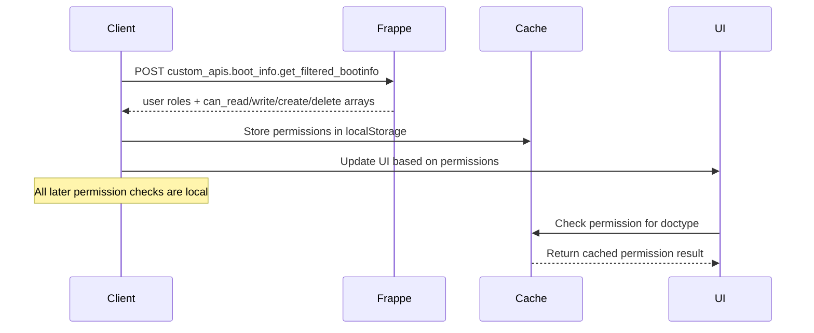

# CI-EAM Frontend Architecture Documentation

## Executive Summary

The CI-EAM (Core Infrastructure Enterprise Asset Management) frontend is a modern Vue 3 application built with TypeScript, Naive UI, and Frappe SDK. The project follows a service-oriented architecture with clear separation of concerns, comprehensive caching strategies, and a robust permission system.

**Key Technologies:**

- Vue 3.5.12 with Composition API
- TypeScript 5.8.3
- Naive UI 2.41.1 (Component Library)
- Pinia 3.0.3 (State Management)
- Vue Router 4.4.5 (Routing)
- Frappe JS SDK 1.9.0 (Backend Integration)
- Vite 5.4.10 (Build Tool)
- Tailwind CSS 3.4.14 (Styling)

---

## 1. Project Structure Overview

```
apps/ci_eam/frontend/src/
├── components/           # Vue components organized by feature
│   ├── core/            # Core business components (FormPage, ListPage)
│   ├── new-form/        # Form-specific components and composables
│   ├── new-list/        # List-specific components and composables
│   ├── layout/          # Layout components (Navbar, Header, Breadcrumb)
│   ├── base/            # Base utility components
│   ├── feature/         # Feature-specific components
│   └── dashboard/       # Dashboard components
├── composables/         # Vue 3 composables
│   ├── services/        # Service-oriented composables
│   ├── useFrappeSDK.ts  # Frappe SDK integration
│   ├── useSettings.ts   # Settings management
│   └── useVueUseUtils.ts # VueUse utilities
├── stores/              # Pinia stores for state management
├── pages/               # Page components organized by domain
├── router/              # Vue Router configuration
├── types/               # TypeScript type definitions
├── utils/               # Utility functions
├── themes/              # Theme configuration
└── assets/              # Static assets
```

---

## 2. Composable Architecture

### 2.1 Service Composables (`composables/services/`)

The application uses a service-oriented architecture with 8 specialized service composables:

#### **useDocumentService.ts** (237 lines)

**Purpose**: Document CRUD operations and form loading

**Key Methods:**

```typescript
const {
  createDocument, // Create new documents
  getDocument, // Load complete document with metadata
  updateDocument, // Update existing documents
  deleteDocument, // Delete documents
  saveDocument, // Save document (create or update)
  submitDocument, // Submit document for approval
  cancelDocument, // Cancel document
  duplicateDocument, // Duplicate existing document
  refreshDocumentInfo, // Refresh document metadata
} = useDocumentService()
```

**Integration Points:**

- Used by `FormPage.vue` for document operations
- Integrates with `useMetadataService` for form metadata
- Handles workflow state management

#### **useMetadataService.ts** (269 lines)

**Purpose**: Metadata operations with intelligent caching

**Key Methods:**

```typescript
const {
  getMetadata, // Get metadata with caching
  refreshMetadata, // Force refresh metadata
  preloadMetadata, // Preload multiple doctypes
  preloadCommonDoctypes, // Preload common doctypes
  clearCache, // Clear specific or all cache
  getCacheStats, // Get cache statistics
} = useMetadataService()
```

**Caching Strategy:**

- **Duration**: 5 minutes
- **Max Size**: 50 doctypes
- **LRU Eviction**: Removes least recently used entries
- **Preloading**: Common doctypes loaded on startup

#### **useListService.ts** (257 lines)

**Purpose**: List operations and pagination

**Key Methods:**

```typescript
const {
  getList, // Get paginated list
  getCount, // Get total count
  getPaginatedList, // Get list with pagination
  getFilteredList, // Get filtered list
  searchInFields, // Search within specific fields
} = useListService()
```

**Features:**

- Pagination support
- Field-based filtering
- Sorting capabilities
- Search within fields

#### **useSearchService.ts** (195 lines)

**Purpose**: Search operations for link fields and general search

**Key Methods:**

```typescript
const {
  searchLinkOptions, // Search for link field options
  searchWithCustomQuery, // Custom query search
  searchWithFilters, // Multi-filter search
  quickSearch, // Quick search functionality
  searchRecent, // Recent document search
} = useSearchService()
```

#### **useWorkflowService.ts** (135 lines)

**Purpose**: Workflow operations and state management

**Key Methods:**

```typescript
const {
  getWorkflowTransitions, // Get available transitions
  applyWorkflowAction, // Apply workflow action
  getWorkflowInfo, // Get workflow state info
  hasWorkflow, // Check if document has workflow
  bulkApplyWorkflowAction, // Bulk workflow operations
} = useWorkflowService()
```

#### **useDocumentActionService.ts** (270 lines)

**Purpose**: Custom document actions and bulk operations

**Key Methods:**

```typescript
const {
  executeDocumentAction, // Execute single action
  getDocumentActions, // Get available actions
  bulkExecuteDocumentAction, // Bulk action execution
  canExecuteAction, // Check action permissions
  executeDocumentActionWithProgress, // Long-running actions
} = useDocumentActionService()
```

#### **useAttachmentService.ts** (408 lines)

**Purpose**: File upload and attachment management

**Key Methods:**

```typescript
const {
  uploadFile, // Single file upload
  uploadMultipleFiles, // Multiple file upload
  removeAttachment, // Remove attachment
  validateFile, // File validation
  getDocumentAttachments, // Get document attachments
} = useAttachmentService()
```

**Features:**

- Progress tracking
- File validation
- Multiple file support
- Attachment management

#### **useClientScriptService.ts** (337 lines)

**Purpose**: Client script integration and dynamic behavior

**Key Methods:**

```typescript
const {
  runHook, // Run client script hook
  clearFieldCustomizations, // Clear field customizations
  getTabConfig, // Get tab configuration
} = useClientScriptService()
```

### 2.2 Core Composables

#### **useFrappeSDK.ts** (77 lines)

**Purpose**: Frappe SDK integration and singleton management

```typescript
// Singleton pattern with lazy initialization
export const useFrappeSDK = () => {
  if (!sdkInstance) {
    sdkInstance = createSDK()
  }
  return sdkInstance
}

// Lazy proxy exports for direct access
export const frappeDB = makeLazyProxy(() => useFrappeSDK().db)
export const frappeCall = makeLazyProxy(() => useFrappeSDK().call)
export const frappeAuth = makeLazyProxy(() => useFrappeSDK().auth)
export const frappeFile = makeLazyProxy(() => useFrappeSDK().file)
```

#### **useSettings.ts** (297 lines)

**Purpose**: Application settings management

**Key Features:**

- Theme management (dark/light mode)
- Table column settings
- List page settings
- Persistent storage with debouncing

#### **useVueUseUtils.ts** (329 lines)

**Purpose**: VueUse utilities and common patterns

**Includes:**

- Debounced functions
- Storage utilities
- Performance monitoring
- Common reactive patterns

### 2.3 Form-Specific Composables (`components/new-form/composables/`)

#### **useFormValidation.ts** (181 lines)

**Purpose**: Form validation logic

**Features:**

- Field-level validation
- Form-level validation
- Custom validation rules
- Error message management

#### **useLinkSearch.ts** (114 lines)

**Purpose**: Link field search functionality

**Features:**

- Debounced search
- Cached results
- Custom query support
- Error handling

#### **useVisibility.ts** (69 lines)

**Purpose**: Field visibility management

**Features:**

- Conditional field visibility
- Tab visibility
- Permission-based visibility
- Dynamic visibility rules

### 2.4 List-Specific Composables (`components/new-list/composables/`)

#### **useListPageState.ts** (232 lines)

**Purpose**: List page state management

**Key Features:**

- Records management
- Loading states
- Pagination
- Search functionality

#### **useColumnManagement.ts** (382 lines)

**Purpose**: Column visibility and management

**Features:**

- Column visibility toggles
- Column reordering
- Settings persistence
- Default column configurations

#### **useSearchDebounce.ts** (42 lines)

**Purpose**: Debounced search functionality

**Features:**

- 300ms debounce delay
- Search term management
- Loading states
- Error handling

#### **useListPageActions.ts** (61 lines)

**Purpose**: List page navigation and actions

**Features:**

- Navigation to forms
- Bulk actions
- Export functionality
- Action permissions

---

## 3. Component Architecture

### 3.1 Core Components (`components/core/`)

#### **FormPage.vue** (765 lines)

**Purpose**: Main form page container

**Composables Used:**

- `useDocumentService` - Document operations
- `useMetadataService` - Form metadata
- `useWorkflowService` - Workflow management
- `useClientScriptService` - Client scripts
- `useGlobalPermissions` - Permission checks

**Key Features:**

- Dynamic form generation
- Workflow state management
- Permission-based UI
- Client script integration
- Attachment handling

#### **ListPage.vue** (556 lines)

**Purpose**: Main list page container

**Composables Used:**

- `useListService` - List operations
- `useSearchService` - Search functionality
- `useGlobalPermissions` - Permission checks
- `useColumnManagement` - Column settings

**Key Features:**

- Dynamic table generation
- Search and filtering
- Pagination
- Bulk actions
- Column management

### 3.2 Form Components (`components/new-form/`)

#### **FormHeader.vue** (362 lines)

**Purpose**: Form header with actions and workflow

**Composables Used:**

- `useFormPermissions` - Permission-based UI
- `useWorkflowService` - Workflow actions
- `useDocumentActionService` - Custom actions

**Features:**

- Save/Cancel/Delete buttons
- Workflow transitions
- Document actions
- Permission-based visibility

#### **FormContent.vue** (316 lines)

**Purpose**: Form content with tabs and fields

**Composables Used:**

- `useFormValidation` - Validation
- `useVisibility` - Field visibility
- `useClientScriptService` - Client scripts

**Features:**

- Tab navigation
- Dynamic field rendering
- Validation display
- Client script integration

#### **FormFields.vue** (242 lines)

**Purpose**: Dynamic field rendering

**Composables Used:**

- `useLinkSearch` - Link field search
- `useFormValidation` - Field validation

**Features:**

- Field type detection
- Dynamic component rendering
- Validation integration
- Link field search

### 3.3 List Components (`components/new-list/`)

#### **DataTable.vue** (297 lines)

**Purpose**: Main data table component

**Composables Used:**

- `useColumnManagement` - Column settings
- `useListPageState` - Data management

**Features:**

- Sortable columns
- Filterable data
- Row selection
- Custom cell rendering

#### **ListHeader.vue** (179 lines)

**Purpose**: List page header with actions

**Composables Used:**

- `useListPermissions` - Permission checks
- `useListPageActions` - Navigation actions

**Features:**

- Add button (permission-based)
- View switcher
- Bulk actions
- Export options

#### **TableControls.vue** (293 lines)

**Purpose**: Search and filter controls

**Composables Used:**

- `useSearchDebounce` - Debounced search
- `useListPageState` - Search state

**Features:**

- Search input
- Filter controls
- Sort options
- View persistence

#### **ListSettingsModal.vue** (318 lines)

**Purpose**: Column visibility management

**Composables Used:**

- `useColumnManagement` - Column settings

**Features:**

- Column visibility toggles
- Column reordering
- Settings persistence
- Default configurations

### 3.4 Layout Components (`components/layout/`)

#### **Navbar.vue**

**Purpose**: Main navigation sidebar

**Composables Used:**

- `useNavbarPermissions` - Menu filtering
- `useGlobalPermissions` - Permission checks

**Features:**

- Dynamic menu generation
- Permission-based filtering
- Collapsible design
- Mobile responsive

#### **Header.vue**

**Purpose**: Top application header

**Features:**

- User information
- Theme toggle
- Notifications
- Quick actions

#### **Breadcrumb.vue**

**Purpose**: Navigation breadcrumbs

**Features:**

- Dynamic breadcrumb generation
- Route-based navigation
- Context awareness

---

## 4. State Management Architecture

### 4.1 Pinia Stores (`stores/`)

#### **useMetadataStore** (`stores/metadata.ts` - 243 lines)

**Purpose**: Metadata caching and management

**Key Features:**

```typescript
interface CachedMetadata {
  fields: FormField[]
  linkedTabs: LinkedTab[]
  documentActions: DocumentAction[]
  permissions: any | null
  hasWorkflow: boolean
  maxAttachments: number
  lastAccessed: number
  expiresAt: number
}
```

**Caching Strategy:**

- **Duration**: 5 minutes
- **Max Size**: 50 doctypes
- **LRU Eviction**: Removes least recently used
- **Preloading**: Common doctypes on startup

#### **useSettingsStore** (`stores/settings.ts` - 214 lines)

**Purpose**: Application settings and preferences

**Key Features:**

```typescript
interface AppSettings {
  theme: { isDarkMode: boolean }
  tables: { [doctypeKey: string]: ColumnSettings }
  listPages: { [doctypeKey: string]: ColumnSettings }
}
```

**Features:**

- Theme management
- Table column settings
- List page settings
- Persistent storage
- Auto-save with debouncing

#### **useAuthStore** (`stores/auth.store.ts` - 178 lines)

**Purpose**: Authentication and user permissions

**Key Features:**

```typescript
interface UserPermissions {
  all_read?: string[]
  can_cancel?: string[]
  can_create?: string[]
  can_delete?: string[]
  can_read?: string[]
  can_write?: string[]
}
```

**Features:**

- User authentication state
- Permission caching
- Session management
- Boot info integration

#### **usePermissionStore** (`composables/services/useGlobalPermissions.ts` - 767 lines)

**Purpose**: Global permission management

**Key Features:**

```typescript
export type PermissionType = 'read' | 'write' | 'create' | 'delete' | 'select'

export interface PermissionObject {
  read: boolean
  write: boolean
  create: boolean
  delete: boolean
  select: boolean
}
```

**Caching Strategy:**

- **Duration**: 30 minutes (longer than metadata)
- **Storage**: localStorage with reactive updates
- **Boot Info Integration**: Uses Frappe boot info
- **Performance**: Debounced permission checks

### 4.2 Domain-Specific Stores

#### **AssetStore** (`stores/asset-management/AssetStore.ts` - 267 lines)

**Purpose**: Asset management specific state

**Features:**

- Asset data management
- Asset relationships
- Asset hierarchy
- Asset search

#### **UserSettingsStore** (`stores/userSettings.ts` - 63 lines)

**Purpose**: Server-side user settings

**Features:**

- User preferences
- Server-side settings
- Settings synchronization

---

## 5. Permission System Architecture

### 5.1 Global Permission System

The application implements a comprehensive permission system with the following components:

#### **Permission Types**

```typescript
export type PermissionType = 'read' | 'write' | 'create' | 'delete' | 'select'
```

#### **Permission Object Structure**

```typescript
export interface PermissionObject {
  read: boolean
  write: boolean
  create: boolean
  delete: boolean
  select: boolean // implicit when read = true
}
```

### 5.2 Permission Store (`useGlobalPermissions.ts`)

#### **Core Features:**

- **Caching**: 30-minute cache with localStorage persistence
- **Boot Info Integration**: Uses Frappe boot info for permissions
- **Performance**: Debounced permission checks
- **Reactive**: VueUse storage for reactive updates

#### **Key Methods:**

```typescript
const {
  canRead, // Check read permission
  canWrite, // Check write permission
  canCreate, // Check create permission
  canDelete, // Check delete permission
  canSelect, // Check select permission (for dropdowns)
} = useGlobalPermissions()
```

### 5.3 Permission Integration Points

#### **Router Integration**

```javascript
// Permission guard for doctype-specific access
router.beforeEach(createPermissionGuard())
```

#### **Component Integration**

- **FormHeader.vue**: Permission-based button visibility
- **ListPage.vue**: Permission-based action availability
- **Navbar.vue**: Permission-based menu filtering

#### **Composable Integration**

- **useFormPermissions**: Form-specific permission checks
- **useListPermissions**: List-specific permission checks
- **useNavbarPermissions**: Navigation permission filtering

### 5.4 Permission Flow



---

## 6. Caching Architecture

### 6.1 Multi-Layer Caching Strategy

#### **Metadata Caching** (`useMetadataStore`)

- **Duration**: 5 minutes
- **Max Size**: 50 doctypes
- **Strategy**: LRU eviction
- **Storage**: In-memory with localStorage backup

#### **Permission Caching** (`useGlobalPermissions`)

- **Duration**: 30 minutes
- **Strategy**: Persistent localStorage
- **Integration**: Boot info based
- **Performance**: Debounced checks

#### **Settings Caching** (`useSettingsStore`)

- **Strategy**: Persistent localStorage
- **Features**: Auto-save with debouncing
- **Scope**: User-specific settings

### 6.2 Cache Management

#### **LRU Eviction Strategy**

```typescript
const setCachedMetadata = (doctype: string, metadata: any) => {
  const entries = Object.entries(cache.value)
  if (entries.length >= MAX_CACHE_SIZE) {
    const sortedEntries = entries.sort(
      (a, b) => a[1].lastAccessed - b[1].lastAccessed,
    )
    const toRemove = sortedEntries.slice(0, entries.length - MAX_CACHE_SIZE + 1)
    toRemove.forEach(([key]) => delete cache.value[key])
  }
}
```

#### **Preloading Strategy**

```typescript
const COMMON_DOCTYPES = [
  'Asset',
  'Asset Class',
  'Work Order',
  'Item',
  'Inventory',
  'Location',
  'Position',
]
```

### 6.3 Cache Performance

#### **Cache Statistics**

- Total entries count
- Valid entries count
- Expired entries count
- Preload status
- Error tracking

#### **Cache Optimization**

- Lazy loading
- Background preloading
- Intelligent eviction
- Persistent storage

---

## 7. Routing Architecture

### 7.1 Route Structure

#### **Dashboard Routes**

```javascript
{
  path: '/dashboard/asset-management',
  name: 'AssetDashboard',
  component: () => import('@/pages/asset-mgmt/AssetDashboard.vue'),
  meta: { requiresAuth: true, breadcrumb: 'Dashboard' }
}
```

#### **Generic Routes**

```javascript
{
  path: '/:doctype',
  name: 'GenericList',
  component: () => import('@/pages/GenericList.vue'),
  meta: { layout: 'list' }
},
{
  path: '/:doctype/:id',
  name: 'GenericForm',
  component: () => import('@/pages/GenericForm.vue'),
  meta: { layout: 'form' }
}
```

### 7.2 Navigation Guards

#### **Authentication Guard**

```javascript
router.beforeEach(async (to, from, next) => {
  const { getLoggedInUser } = useFrappeSDK()
  const authStore = useAuthStore()

  try {
    const user = await getLoggedInUser()
    const isLoggedIn = !!user

    if (isLoggedIn && !authStore.isAuthenticated) {
      await authStore.fetchPermissions()
    }

    const requiresAuth = to.meta.requiresAuth !== false

    if (requiresAuth && !isLoggedIn) {
      next({ name: 'Login', query: { redirect: to.fullPath } })
    } else {
      next()
    }
  } catch (error) {
    next({ name: 'Login', query: { redirect: to.fullPath } })
  }
})
```

#### **Permission Guard**

```javascript
router.beforeEach(createPermissionGuard())
```

### 7.3 Route Organization

#### **Domain-Specific Routes**

- Asset Management: `/dashboard/asset-management`
- Maintenance Management: `/dashboard/maintenance-management`
- Work Management: `/dashboard/work-management`
- Purchasing Store: `/dashboard/purchasing-store`

#### **Common Routes**

- Landing Page: `/`
- Login: `/login`
- Settings: `/settings`
- Access Denied: `/access-denied/:doctype?` (Temporarily removed for development)
- 404: `/:pathMatch(.*)*`

---

## 8. Component Integration Patterns

### 8.1 Form Component Integration

#### **FormPage.vue Integration**

```vue
<template>
  <FormHeader
    :doctype="doctype"
    :document-id="documentId"
    :permissions="formPermissions"
    @save="handleSave"
    @cancel="handleCancel"
  />
  <FormContent
    :fields="visibleFields"
    :form-data="formData"
    :mode="mode"
    @update:form-data="handleFieldUpdate"
  />
</template>

<script setup>
const { formData, loading, save, cancel } = useFormState(doctype, documentId)
const { metadata, fields, linkedTabs } = useMetadataProcessor(doctype)
const { canEdit, canDelete, canCreate } = useFormPermissions(doctype)
</script>
```

#### **Field Component Integration**

```vue
<template>
  <DynamicField
    :field="field"
    :value="formData[field.fieldname]"
    :mode="mode"
    :doctype="doctype"
    @update:value="handleFieldUpdate"
  />
</template>

<script setup>
const { searchOptions } = useLinkSearch(field)
const { validateField } = useFormValidation(field)
</script>
```

### 8.2 List Component Integration

#### **ListPage.vue Integration**

```vue
<template>
  <ListHeader
    :doctype="doctype"
    :permissions="listPermissions"
    @add="handleAdd"
    @bulk-delete="handleBulkDelete"
  />
  <DataTable
    :columns="visibleColumns"
    :data="records"
    :loading="loading"
    :pagination="pagination"
    @sort="handleSort"
    @filter="handleFilter"
  />
</template>

<script setup>
const { records, loading, pagination, loadRecords } = useListPageState(doctype)
const { canCreate, canDelete } = useListPermissions(doctype)
const { visibleColumns, toggleColumn } = useColumnManagement(doctype)
</script>
```

### 8.3 Navigation Integration

#### **Navbar.vue Integration**

```vue
<template>
  <nav>
    <template v-for="menu in filteredMenuOptions" :key="menu.key">
      <MenuItem
        :label="menu.label"
        :icon="menu.icon"
        :children="menu.children"
        @click="handleMenuClick"
      />
    </template>
  </nav>
</template>

<script setup>
const { filteredMenuOptions } = useNavbarPermissions()
const { canRead } = useGlobalPermissions()
</script>
```

---

## 9. Error Handling Architecture

### 9.1 Service-Level Error Handling

#### **Consistent Error Patterns**

```typescript
const handleServiceError = (error: any, context: string) => {
  console.error(`${context} error:`, error)

  if (error?.exc_type === 'ValidationError') {
    return { success: false, message: error.message }
  }

  if (error?.exc_type === 'PermissionError') {
    return {
      success: false,
      message: 'Access denied (temporarily disabled for development)',
    }
  }

  return { success: false, message: 'An unexpected error occurred' }
}
```

#### **Error Recovery Strategies**

- **Network Errors**: Retry with exponential backoff
- **Permission Errors**: Log warning (access denied temporarily disabled for development)
- **Validation Errors**: Display field-specific messages
- **Server Errors**: Show generic error with retry option

### 9.2 Component-Level Error Handling

#### **Error Boundaries**

```vue
<template>
  <div v-if="error" class="error-container">
    <ErrorMessage :error="error" @retry="handleRetry" />
  </div>
  <div v-else>
    <!-- Component content -->
  </div>
</template>

<script setup>
const error = ref(null)

const handleError = (err) => {
  error.value = err
  console.error('Component error:', err)
}
</script>
```

### 9.3 Global Error Handling

#### **Vue Error Handler**

```javascript
app.config.errorHandler = (err, instance, info) => {
  console.error('Global error:', err)
  console.error('Component:', instance)
  console.error('Info:', info)

  // Show user-friendly error message
  showErrorMessage('An unexpected error occurred')
}
```

---

## 10. Performance Optimization

### 10.1 Bundle Optimization

#### **Vite Configuration**

```typescript
export default defineConfig({
  build: {
    target: 'es2015',
    rollupOptions: {
      output: {
        manualChunks: {
          'naive-ui': ['naive-ui'],
          'frappe-sdk': ['frappe-js-sdk'],
          'vue-vendor': ['vue', 'vue-router', 'pinia'],
        },
      },
    },
  },
  optimizeDeps: {
    include: ['frappe-ui > feather-icons', 'showdown', 'engine.io-client'],
  },
})
```

### 10.2 Lazy Loading

#### **Route-Based Code Splitting**

```javascript
{
  path: '/dashboard/asset-management',
  component: () => import('@/pages/asset-mgmt/AssetDashboard.vue')
}
```

#### **Component Lazy Loading**

```typescript
const DataTable = defineAsyncComponent(
  () => import('../new-list/DataTable.vue'),
)
```

### 10.3 Caching Optimization

#### **Intelligent Preloading**

```typescript
const preloadCommonDoctypes = async () => {
  const COMMON_DOCTYPES = ['Asset', 'Asset Class', 'Work Order', 'Item']
  await preloadDoctypes(COMMON_DOCTYPES, loadMetadataFn)
}
```

#### **Debounced Operations**

```typescript
const debouncedSearch = useDebounceFn(searchFunction, 300)
```

---

## 11. Development Patterns

### 11.1 Dependency Injection

#### **Service Injection Pattern**

```typescript
// Service injection
const { getDocument, saveDocument, deleteDocument } = useDocumentService()
const { getMetadata, refreshMetadata } = useMetadataService()

// Composable injection
const { formData, loading, save, cancel } = useFormState(doctype, documentId)
```

### 11.2 Composable Organization

#### **Single Responsibility Principle**

- Each composable has a single, clear purpose
- Services handle specific domains
- Utilities provide common functionality
- State management is centralized

#### **Consistent API Design**

```typescript
// Consistent method signatures across services
const { getList, getCount, getPaginatedList } = useListService()
const { getDocument, saveDocument, deleteDocument } = useDocumentService()
```

### 11.3 Type Safety

#### **Comprehensive Type Definitions**

```typescript
interface FormField {
  fieldname: string
  label: string
  fieldtype: string
  required: boolean
  options?: string
  default?: any
}

interface PermissionObject {
  read: boolean
  write: boolean
  create: boolean
  delete: boolean
  select: boolean
}
```

---

## 12. Testing Strategy

### 12.1 Unit Testing

#### **Composable Testing**

```typescript
// Test service composables
describe('useDocumentService', () => {
  it('should create document successfully', async () => {
    const { createDocument } = useDocumentService()
    const result = await createDocument('Asset', { name: 'Test Asset' })
    expect(result.success).toBe(true)
  })
})
```

#### **Component Testing**

```typescript
// Test components with composables
describe('FormPage.vue', () => {
  it('should render form fields correctly', () => {
    const wrapper = mount(FormPage, {
      props: { doctype: 'Asset', documentId: 'ASSET-001' },
    })
    expect(wrapper.find('.form-fields').exists()).toBe(true)
  })
})
```

### 12.2 Integration Testing

#### **Service Integration**

```typescript
// Test service interactions
describe('Form Integration', () => {
  it('should load document with metadata', async () => {
    const { getDocument } = useDocumentService()
    const { getMetadata } = useMetadataService()

    const document = await getDocument('Asset', 'ASSET-001')
    const metadata = await getMetadata('Asset')

    expect(document).toBeDefined()
    expect(metadata).toBeDefined()
  })
})
```

---

## 13. Deployment Architecture

### 13.1 Build Configuration

#### **Vite Build**

```typescript
export default defineConfig({
  plugins: [frappeui(), vue()],
  resolve: {
    alias: { '@': path.resolve(__dirname, 'src') },
  },
  build: {
    outDir: `../${path.basename(path.resolve('..'))}/public/frontend`,
    target: 'es2015',
  },
})
```

#### **Environment Configuration**

```typescript
// Environment-specific settings
const isDevelopment = import.meta.env.DEV
const isProduction = import.meta.env.PROD
const apiBaseUrl = import.meta.env.VITE_API_BASE_URL || '/'
```

### 13.2 Asset Management

#### **Static Assets**

- Images and icons in `assets/`
- Theme configurations in `themes/`
- Type definitions in `types/`

#### **Build Output**

- Compiled assets in `public/frontend/`
- Optimized bundles with code splitting
- Compressed and minified for production

---

## 14. Security Architecture

### 14.1 Authentication

#### **Frappe SDK Integration**

```typescript
const { login, logout, getLoggedInUser } = useFrappeSDK()
```

#### **Session Management**

- Automatic session validation
- Secure token handling
- Session timeout handling

### 14.2 Permission Security

#### **Server-Side Validation**

- All permissions validated server-side
- Boot info provides permission data
- No client-side permission bypass

#### **Route Protection**

```javascript
// Permission-based route guards
router.beforeEach(createPermissionGuard())
```

### 14.3 Data Security

#### **Input Validation**

- Client-side validation for UX
- Server-side validation for security
- XSS prevention through proper escaping

#### **API Security**

- CSRF protection
- Rate limiting
- Input sanitization

---

## 15. Monitoring and Analytics

### 15.1 Performance Monitoring

#### **Cache Statistics**

```typescript
const getCacheStats = () => ({
  totalEntries: entries.length,
  validEntries: validEntries.length,
  expiredEntries: entries.length - validEntries.length,
  cacheSize: MAX_CACHE_SIZE,
  cacheDuration: CACHE_DURATION,
})
```

#### **Error Tracking**

```typescript
const trackError = (error: Error, context: string) => {
  console.error(`[${context}] Error:`, error)
  // Send to error tracking service
}
```

### 15.2 User Analytics

#### **Usage Tracking**

- Page view tracking
- Feature usage monitoring
- Performance metrics
- Error rate monitoring

---

## 16. Future Enhancements

### 16.1 Planned Improvements

#### **Performance Optimizations**

- Virtual scrolling for large lists
- Advanced caching strategies
- Bundle size optimization
- Image optimization

#### **Feature Enhancements**

- Advanced search capabilities
- Real-time updates
- Offline support
- Mobile app development

#### **Developer Experience**

- Enhanced TypeScript support
- Better error messages
- Improved documentation
- Development tools

### 16.2 Architecture Evolution

#### **Micro-Frontend Architecture**

- Module federation
- Independent deployments
- Shared component library
- Service mesh integration

#### **Advanced State Management**

- Reactive queries
- Optimistic updates
- Conflict resolution
- Offline synchronization

---

## Conclusion

The CI-EAM frontend architecture provides a robust, scalable foundation for enterprise asset management. The service-oriented architecture with comprehensive caching, permission systems, and modern Vue 3 patterns ensures maintainability, performance, and security. The modular design allows for easy extension and modification while maintaining consistency across the application.

**Key Strengths:**

- Clear separation of concerns
- Comprehensive caching strategy
- Robust permission system
- Modern Vue 3 patterns
- TypeScript-first development
- Service-oriented architecture
- Performance optimization
- Security best practices

**Architecture Principles:**

- Single responsibility
- Dependency injection
- Reactive patterns
- Type safety
- Performance optimization
- Security by design
- Maintainability
- Scalability

This architecture provides a solid foundation for building and maintaining enterprise-grade applications with modern web technologies.
